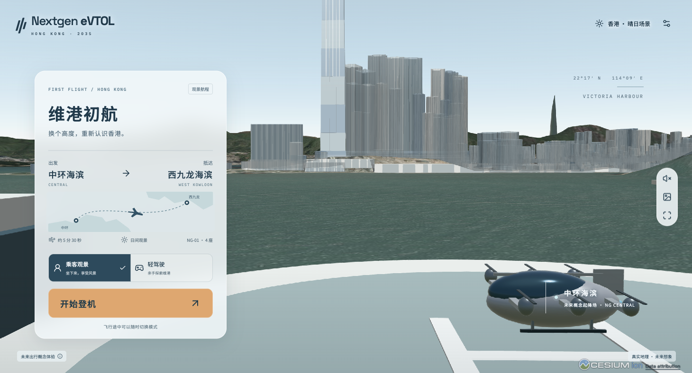
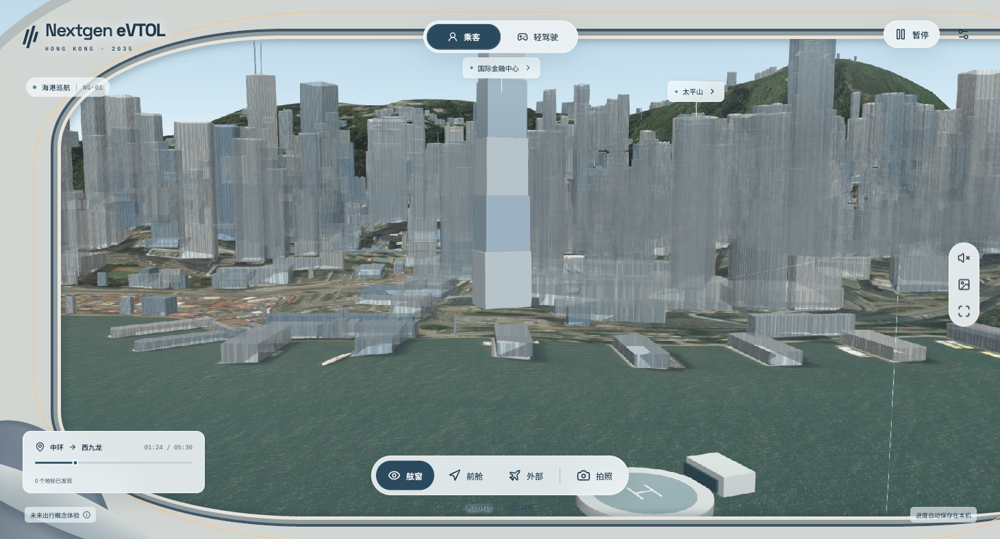
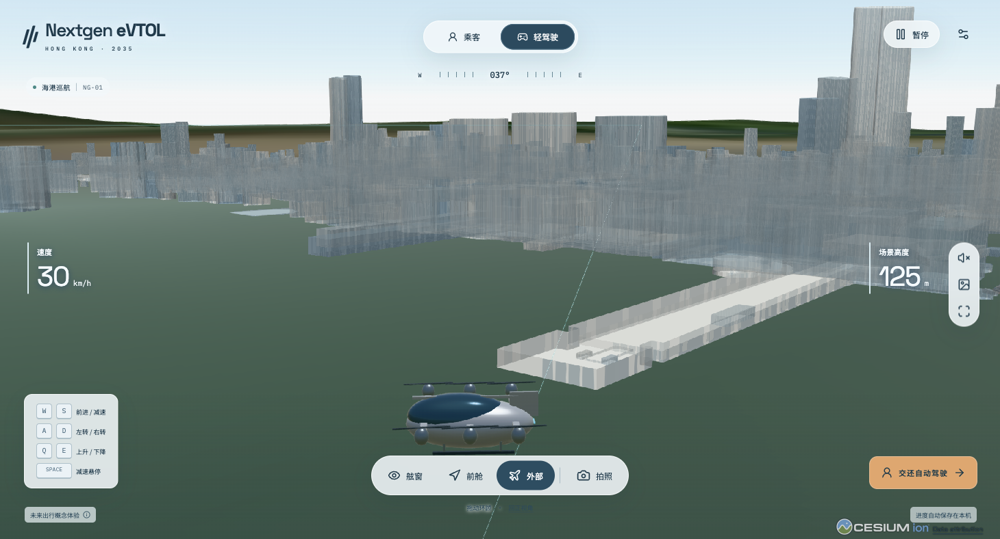
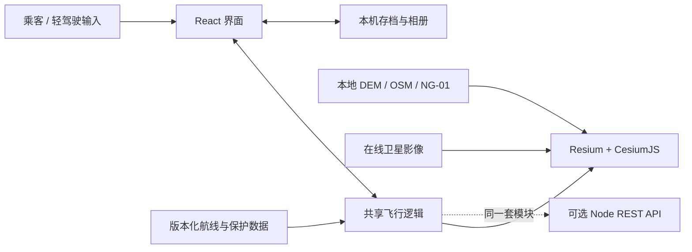

# Nextgen eVTOL

**如果未来可以乘 eVTOL 穿过香港，你会选择靠窗看风景，还是亲手驾驶？**

在浏览器里登上概念飞行器 NG-01，从中环海滨飞往西九龙。随时切换乘客观景与轻驾驶，用一段 5 分 30 秒的航程，体验未来的维港日常。

[](https://github.com/hexing-ai/nextgen-evtol/actions/workflows/pages.yml)
[](https://hexing-ai.github.io/nextgen-evtol/)
[](https://nodejs.org/)

**[立即体验 ↗](https://hexing-ai.github.io/nextgen-evtol/)** · [本地启动](#本地启动) · [架构说明](docs/ARCHITECTURE.md) · [English](README.en.md)

[](https://hexing-ai.github.io/nextgen-evtol/)

*当前版本的浏览器实机截图。开放地理数据搭建的可玩三维原型，采用简化建筑与概念设施。*

## 三分钟，认识你的第一次空中通勤

无需注册、无需安装客户端、无需 API key。[打开 Demo](https://hexing-ai.github.io/nextgen-evtol/)，等场景准备完成后：

1. **登机看香港**：选择「乘客观景」→「开始登机」，自动起飞；拖动画面环顾，切换舷窗、前舱、外部镜头。
2. **接过驾驶权**：点顶部「轻驾驶」，用 W/S、A/D、Q/E 探索维港；点「交还自动驾驶」尝试接回原航线。
3. **带走一张风景**：点「拍照」，从右侧相册下载；点可见地标标签发现香港。离开页面会自动暂停，可稍后恢复。

完整自动航程约 5 分 30 秒；手动探索和暂停会延长体验。建议先用桌面浏览器，首次加载时间取决于网络和 GPU。

## 你能体验什么

| 体验 | 当前实现 |
| --- | --- |
| 坐下来旅行 | 中环海滨 → 西九龙海滨，垂直起飞、巡航、进近与降落 |
| 随时轻驾驶 | 加减速、转向、升降、减速悬停与自动接回；区域、地形和建筑保护 |
| 换个角度看香港 | 舷窗、前舱、外部跟随；拖动环顾、地标发现 |
| 留住这一程 | 本机相册最多 12 张，可下载；航程自动存档、暂停后恢复 |

| 乘客观景 · 舷窗 | 轻驾驶 · 外部跟随 |
| --- | --- |
|  |  |

地形来自香港区域 DEM，维港核心区包含 **7,748 个 OSM 建筑及建筑分层轮廓**。建筑为轮廓拉伸与简化立面，部分高度估算；不是官方精细数字孪生。截图来源与数据署名见 [展示素材说明](docs/images/README.md)。

## 本地启动

准备好 **Git、Node.js 22.12+ 和 npm**。推荐 Node 22 LTS；使用 nvm 时可运行 `nvm install && nvm use`。

```sh
git clone https://github.com/hexing-ai/nextgen-evtol.git
cd nextgen-evtol
npm ci
npm run dev
```

打开终端显示的地址，通常为 [http://127.0.0.1:5173](http://127.0.0.1:5173)。看到「维港初航」和可点击的「开始登机」即启动成功。端口占用时 Vite 会选下一个空闲端口。

**不需要 `.env`、数据库、Cesium ion token 或单独启动后端。** 地形、建筑快照和机型已随仓库提供。`npm start` 启动的是可选 REST API，不是网页。

需要支持 **WebGL 2**、开启硬件加速的现代浏览器。在线卫星影像和字体需要联网；影像服务失败时仍可显示本地地形和建筑。遇到问题见 [安装与排错](docs/DEVELOPMENT.md#常见问题)。

```sh
npm run check      # 数据校验 + 自动化测试 + 生产构建 + 静态接口导出
npm run preview    # 构建后预览，通常为 http://127.0.0.1:4173
```

## 操作速查

| 操作 | 输入 |
| --- | --- |
| 前进 / 减速 | W / S（轻驾驶模式） |
| 左转 / 右转 | A / D |
| 上升 / 下降 | Q / E |
| 减速悬停 | Space |
| 暂停 / 继续 | Esc，或右上角按钮 |
| 环顾 / 回正 | 拖动画面 /「回正视角」 |
| 切换模式、镜头、拍照 | 点击界面按钮 |

小屏提供触控方向按钮；设置里可切换流畅画质。存档和照片只在当前浏览器保存，不跨设备同步。

## 它是怎样运行的

React 负责界面，Resium / CesiumJS 渲染香港。浏览器直接运行共享飞行逻辑，GitHub Pages 仅提供静态文件，因此体验过程不需要后端服务器。



深入了解：[架构与数据流](docs/ARCHITECTURE.md) · [开发与部署](docs/DEVELOPMENT.md) · [API 契约](docs/API.md) · [验证记录](docs/release.md)

## 当前范围与下一步

首版专注 **维港观景区的一条概念航线**；香港区域地形覆盖更广，但尚未开放全港自由飞行。飞机、起降场和航线是未来设想，游戏保护不代表真实空域许可或工程安全验证。

已完成：双模式、三镜头、地标、摄影、恢复存档与 GitHub Pages Demo。接下来希望优先探索：

- [ ] 更精细的香港建筑、材质与座舱，先解决数据授权和加载成本。
- [ ] 更多经过地形与体验验证的观景航线。
- [ ] 手机真机性能优化、更多浏览器与 GPU 验证。
- [ ] 中英界面切换与更完整的无障碍操作。

以上是方向，不是已发布能力或交付日期承诺。当前不包含无人机物流、运营经营和专业飞行训练。

## 参与与许可

欢迎用 [Issue](https://github.com/hexing-ai/nextgen-evtol/issues) 分享体验反馈、复现问题和最想看到的香港航线；提交前可看 [参与指南](CONTRIBUTING.md)。如果你也想看到香港未来空中出行的样子，欢迎 **Star**，方便回来追踪下一次更新。

本项目复用 CesiumJS、Resium、React 等开源组件，参考 Flight3DView 的播放与镜头组织方式，未复制其源文件。**原创项目代码目前尚未指定开源许可证**；公开可浏览不等于已授予自由再分发或商用许可。OSM 派生数据库按 ODbL 1.0 提供，第三方组件、地形与影像各自遵循其条款。详见 [第三方代码与数据声明](THIRD_PARTY_NOTICES.md)。
