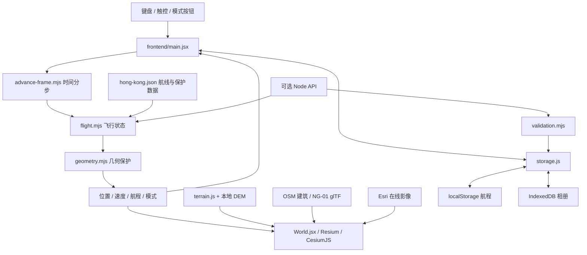

# 架构与数据流

[返回首页](../README.md) · [开发与部署](DEVELOPMENT.md) · [API](API.md)

Nextgen eVTOL 是浏览器端运行的香港观景原型。生产网站使用 GitHub Pages；交互不需要动态服务器，存档和照片留在浏览器。

## 运行时



- **界面与输入**：`main.jsx` 管理登机、飞行、暂停、抵达及弹窗。模式切换保留当前位置；轻驾驶交还后由接回逻辑尝试回到航线，受阻时可悬停。
- **共享规则**：`flight.mjs`、`geometry.mjs`、`validation.mjs` 供浏览器和 Node API 共用。帧推进在浏览器本地执行，不逐帧请求 HTTP。
- **时间与保护**：`advance-frame.mjs` 将一帧经过的时间拆成合规小步，单次异常停顿最多计入 1 秒；暂停不推进。几何层处理区域、高度、地形与障碍代理，属于游戏规则。
- **渲染**：`World.jsx` 将局部坐标转换为地理坐标，更新飞机、镜头、建筑和地标投影；渲染与规则分开。场景使用静态日间环境，不提供真实天气。
- **持久化**：航程每 5 秒及主要操作时写入 localStorage；恢复前验证场景和状态版本，并保持暂停。照片写入 IndexedDB，最多 12 张；没有账户或云同步。

## 静态网站与可选 API

| 部分 | 静态 Demo | 可选 Node 服务 |
| --- | --- | --- |
| 网页 | Vite 构建的 `dist/` | 不负责提供网页 |
| 场景 | 前端导入版本化 JSON；构建另导出只读 JSON | GET 接口提供同一目录数据 |
| 飞行计算 | 浏览器直接调用共享模块 | POST 接口用于联调或其他客户端 |
| 存档 | localStorage / IndexedDB | 校验请求中的存档，不持久化 |
| 启动 | `npm run dev` / Pages | `npm start` |

构建分三步：复制 Cesium runtime 与依赖声明 → Vite 打包 → 导出 `api/v1/*.json`、校验和与 `runtime/*.mjs`。当前 UI 直接导入场景和共享模块；静态 API 和独立 runtime 是其他调用方可使用的附加输出。

`base: './'` 与相对资源路径支持 GitHub Pages 的 `/nextgen-evtol/` 子目录。Pages 不执行 Node，也不接受动态 POST。发布流程见 [开发与部署](DEVELOPMENT.md#发布到-github-pages)。

## 地理数据与模型

| 数据 | 当前来源与处理 | 边界 |
| --- | --- | --- |
| 地形 | Mapzen Terrain Tiles，重采样到 `hk-terrain.bin` 高度网格 | 113.83–114.45°E、22.15–22.58°N；未做香港官方高程基准校准 |
| 建筑 | 7,748 个 OSM 建筑/分层轮廓，保留源 way ID | 已有高度或层数优先；缺失时估算；未覆盖所有关系和最新建筑 |
| 地标 | IFC、ICC 等原创简化轮廓 | 不是测绘或精细纹理模型 |
| 飞行器、平台 | 程序生成的 NG-01 glTF 与概念起降平台 | 不对应认证机型或实际获批设施 |
| 地表影像 | 运行时请求 Esri World Imagery | 外部服务依赖，未打包或重新授权 |
| 香港官方 3D Tiles | 已识别为未来接入来源 | 当前未使用，服务需要授权 key |

`terrainProtection` 为飞行规则提供地形保护网格；建筑保护采用代理包围盒，不能代表精确碰撞网格或航空安全。DEM 范围大于可驾驶范围。

## 代码地图

```text
frontend/
  main.jsx               页面、输入、飞行循环
  World.jsx              三维渲染与镜头
  terrain.js             Cesium 高度网格适配
  advance-frame.mjs      帧时间分步推进
  storage.js / audio.js  本机持久化与合成声音
backend/
  data/hong-kong.json     版本化场景、航线与保护数据
  src/                   共享飞行规则、校验和 Node API
  test/                  规则、连续航程、HTTP 等测试
public/
  geo/                   DEM 与 OSM 派生数据库
  models/                NG-01 机型
scripts/                 资源准备、数据加工与静态导出
.github/workflows/       检查与 Pages 发布
```

## 复用依据与权衡

CesiumJS 提供地理坐标与三维渲染，Resium 负责 React 生命周期衔接；Flight3DView 提供过播放/镜头组织思路，没有复制业务源文件。选择浏览器本地计算让 Demo 无需后端运维，也意味着没有云存档、多人状态或防作弊服务。

Cesium 引擎包目前约 4.62 MB（gzip 约 1.27 MB，随依赖版本变化），是首载成本的主要来源之一。手机仅完成窄屏视口检查，不能由此推断所有手机 GPU 的性能。

许可证、地形来源与服务署名见 [THIRD_PARTY_NOTICES.md](../THIRD_PARTY_NOTICES.md)。
